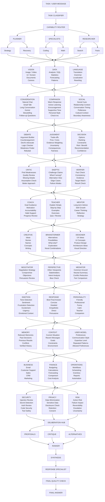

```mermaid
flowchart TD
    TASK["TASK / USER MESSAGE"] --> CLASSIFIER["TASK CLASSIFIER"] --> ROUTER["CAPABILITY ROUTER"]

    ROUTER --> PLANNER["PLANNER"]
    ROUTER --> SPECIALISTS["SPECIALISTS"]
    ROUTER --> RESEARCHER["RESEARCHER"]
    PLANNER --> STRATEGY["Strategy"] & RECOVERY["Recovery"]
    SPECIALISTS --> CODING["Coding"] & MATH["Math"]
    RESEARCHER --> SEARCH["Search"] & FACTS["Facts"]
    STRATEGY & RECOVERY & CODING & MATH & SEARCH & FACTS --> J1(( ))

    J1 --> VISION["VISION<br/>Image / Video<br/>UI / Screen<br/>Documents<br/>Camera"]
    J1 --> DATA["DATA<br/>Analysis / SQL<br/>Statistics<br/>Forecasting<br/>Patterns"]
    J1 --> LANGUAGE["LANGUAGE<br/>Translation<br/>Grammar<br/>Localization<br/>Rewriting"]
    VISION & DATA & LANGUAGE --> J2(( ))

    J2 --> CONVERSATION["CONVERSATION<br/>Natural Chat<br/>Small Talk<br/>Long Conversation<br/>Humor<br/>Storytelling<br/>Follow-up Questions"]
    J2 --> COMPANION["COMPANION<br/>Warm Response<br/>Active Listening<br/>Encouragement<br/>Supportive Tone<br/>Personal Style<br/>Check-ins"]
    J2 --> SOCIAL["SOCIAL<br/>Social Cues<br/>Relationship Context<br/>Conversation Timing<br/>Politeness<br/>Cultural Context<br/>Boundary Awareness"]
    CONVERSATION & COMPANION & SOCIAL --> J3(( ))

    J3 --> DEBATE["DEBATE<br/>Argument Builder<br/>Counterargument<br/>Devil's Advocate<br/>Logic Checker<br/>Weakness Finder<br/>Rebuttal"]
    J3 --> JUDGMENT["JUDGMENT<br/>Trade-offs<br/>Pros / Cons<br/>Evidence Weighting<br/>Uncertainty<br/>Consequences<br/>Fairness"]
    J3 --> DECISION["DECISION<br/>Options<br/>Ranking<br/>Constraints<br/>Risk / Benefit<br/>Recommendation<br/>Confidence"]
    DEBATE & JUDGMENT & DECISION --> J4(( ))

    J4 --> CRITIC["CRITIC<br/>Find Weaknesses<br/>Quality Review<br/>Missing Details<br/>Assumption Check<br/>Better Approach"]
    J4 --> SKEPTIC["SKEPTIC<br/>Challenge Claims<br/>What if wrong?<br/>Alternative View<br/>Edge Cases<br/>Failure Modes"]
    J4 --> VERIFIER["VERIFIER<br/>Fact Check<br/>Consistency<br/>Evidence<br/>Target Match<br/>Result Check"]
    CRITIC & SKEPTIC & VERIFIER --> J5(( ))

    J5 --> COACH["COACH<br/>Goal Guidance<br/>Motivation<br/>Accountability<br/>Habit Support<br/>Progress Review"]
    J5 --> TEACHER["TEACHER<br/>Explain Simply<br/>Step-by-Step<br/>Examples<br/>Exercises<br/>Quiz / Review"]
    J5 --> MENTOR["MENTOR<br/>Long-term Advice<br/>Skill Growth<br/>Career Thinking<br/>Reflection<br/>Strategy"]
    COACH & TEACHER & MENTOR --> J6(( ))

    J6 --> CREATIVE["CREATIVE<br/>Ideas<br/>Stories<br/>Names<br/>Concepts<br/>Writing"]
    J6 --> BRAINSTORMER["BRAINSTORMER<br/>Alternatives<br/>Possibilities<br/>What else?<br/>Exploration<br/>Novel Combinations"]
    J6 --> DESIGNER["DESIGNER<br/>UX Ideas<br/>UI Concepts<br/>Product Design<br/>Architecture Ideas<br/>Visual Direction"]
    CREATIVE & BRAINSTORMER & DESIGNER --> J7(( ))

    J7 --> NEGOTIATOR["NEGOTIATOR<br/>Negotiation Strategy<br/>Compromise<br/>Objections<br/>Persuasion Review"]
    J7 --> PERSPECTIVE["PERSPECTIVE<br/>Other Viewpoints<br/>Stakeholders<br/>Intent Analysis<br/>Bias Check"]
    J7 --> MEDIATOR["MEDIATOR<br/>Common Ground<br/>Neutral Summary<br/>Conflict Reduction<br/>Fair Comparison"]
    NEGOTIATOR & PERSPECTIVE & MEDIATOR --> J8(( ))

    J8 --> EMOTION["EMOTION<br/>Tone Detection<br/>Sentiment<br/>Frustration Detection<br/>Excitement<br/>Urgency<br/>Emotional Context"]
    J8 --> RESPONSE["RESPONSE<br/>Best Final Answer<br/>Concise<br/>Detailed<br/>Empathetic<br/>Direct<br/>Persuasive"]
    J8 --> PERSONALITY["PERSONALITY<br/>Friendly<br/>Professional<br/>Funny<br/>Calm<br/>Teacher<br/>Companion"]
    EMOTION & RESPONSE & PERSONALITY --> J9(( ))

    J9 --> MEMORY["MEMORY<br/>Relevant Memories<br/>Past Decisions<br/>Previous Results<br/>Conflicts<br/>Verified History"]
    J9 --> CONTEXT["CONTEXT<br/>Current Situation<br/>Recent Messages<br/>Goals<br/>Constraints<br/>Environment"]
    J9 --> USER_MODEL["USER MODEL<br/>Preferences<br/>Communication Style<br/>Expertise Level<br/>Repeated Patterns<br/>Allowed Preferences"]
    MEMORY & CONTEXT & USER_MODEL --> J10(( ))

    J10 --> BUSINESS["BUSINESS<br/>Email<br/>Customer Support<br/>Sales<br/>CRM<br/>Marketing"]
    J10 --> FINANCE["FINANCE<br/>Budgeting<br/>Calculations<br/>Forecasting<br/>Comparison<br/>Cost Analysis"]
    J10 --> OPERATIONS["OPERATIONS<br/>Workflows<br/>Scheduling<br/>Inventory<br/>Reports<br/>Automation"]
    BUSINESS & FINANCE & OPERATIONS --> J11(( ))

    J11 --> SECURITY["SECURITY<br/>Injection Review<br/>Secret Detection<br/>Auth Review<br/>Code Security<br/>Tool Safety"]
    J11 --> PRIVACY["PRIVACY<br/>Data Minimization<br/>Sensitive Data<br/>Disclosure Check<br/>Retention<br/>Consent"]
    J11 --> RISK["RISK<br/>Action Risk<br/>Failure Impact<br/>Reversibility<br/>Escalation<br/>Uncertainty"]
    SECURITY & PRIVACY & RISK --> HUB["DELIBERATION HUB"]

    HUB --> PROPOSALS["PROPOSALS"] & CRITIQUE["CRITIQUE"] & ALTERNATIVES["ALTERNATIVES"]
    PROPOSALS & CRITIQUE & ALTERNATIVES --> RANKER["RANKER"]
    RANKER --> SYNTHESIS["SYNTHESIS"] --> RESPONSE_SPECIALIST["RESPONSE SPECIALIST"]
    RESPONSE_SPECIALIST --> FINAL_QUALITY_CHECK["FINAL QUALITY CHECK"] --> FINAL_ANSWER["FINAL ANSWER"]

    classDef junction fill:#fff,stroke:#64748b,stroke-width:2px,color:#fff;
    class J1,J2,J3,J4,J5,J6,J7,J8,J9,J10,J11 junction;
```
