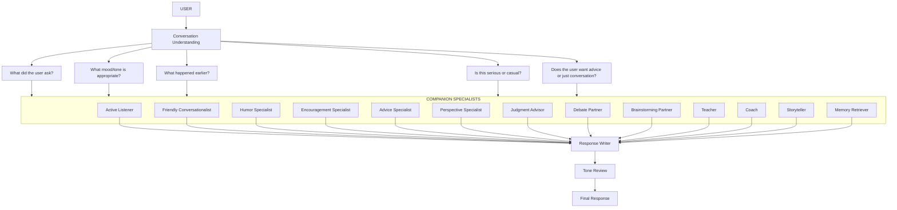

```mermaid
flowchart TD
    USER["USER"] --> UNDERSTANDING["Conversation Understanding"]

    UNDERSTANDING --> ASK["What did the user ask?"]
    UNDERSTANDING --> TONE["What mood/tone is appropriate?"]
    UNDERSTANDING --> EARLIER["What happened earlier?"]
    UNDERSTANDING --> SERIOUS["Is this serious or casual?"]
    UNDERSTANDING --> INTENT["Does the user want advice or just conversation?"]

    ASK --> SPECIALISTS
    TONE --> SPECIALISTS
    EARLIER --> SPECIALISTS
    SERIOUS --> SPECIALISTS
    INTENT --> SPECIALISTS

    subgraph SPECIALISTS["COMPANION SPECIALISTS"]
        direction TB
        ACTIVE_LISTENER["Active Listener"]
        FRIENDLY_CONVERSATIONALIST["Friendly Conversationalist"]
        HUMOR_SPECIALIST["Humor Specialist"]
        ENCOURAGEMENT_SPECIALIST["Encouragement Specialist"]
        ADVICE_SPECIALIST["Advice Specialist"]
        PERSPECTIVE_SPECIALIST["Perspective Specialist"]
        JUDGMENT_ADVISOR["Judgment Advisor"]
        DEBATE_PARTNER["Debate Partner"]
        BRAINSTORMING_PARTNER["Brainstorming Partner"]
        TEACHER["Teacher"]
        COACH["Coach"]
        STORYTELLER["Storyteller"]
        MEMORY_RETRIEVER["Memory Retriever"]
    end

    ACTIVE_LISTENER --> RESPONSE_WRITER["Response Writer"]
    FRIENDLY_CONVERSATIONALIST --> RESPONSE_WRITER
    HUMOR_SPECIALIST --> RESPONSE_WRITER
    ENCOURAGEMENT_SPECIALIST --> RESPONSE_WRITER
    ADVICE_SPECIALIST --> RESPONSE_WRITER
    PERSPECTIVE_SPECIALIST --> RESPONSE_WRITER
    JUDGMENT_ADVISOR --> RESPONSE_WRITER
    DEBATE_PARTNER --> RESPONSE_WRITER
    BRAINSTORMING_PARTNER --> RESPONSE_WRITER
    TEACHER --> RESPONSE_WRITER
    COACH --> RESPONSE_WRITER
    STORYTELLER --> RESPONSE_WRITER
    MEMORY_RETRIEVER --> RESPONSE_WRITER

    RESPONSE_WRITER --> TONE_REVIEW["Tone Review"]
    TONE_REVIEW --> FINAL_RESPONSE["Final Response"]
```
