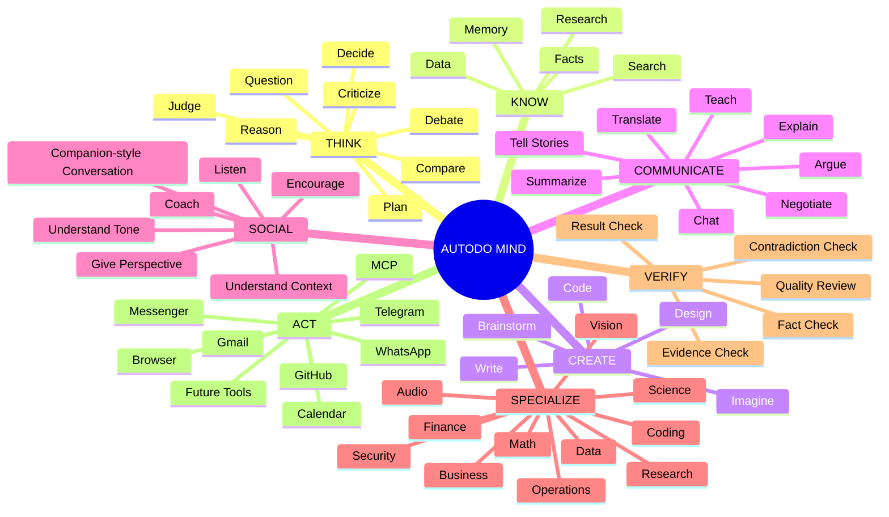

```mermaid
mindmap
  root((AUTODO MIND))
    THINK
      Reason
      Plan
      Judge
      Compare
      Question
      Criticize
      Debate
      Decide
    KNOW
      Research
      Search
      Facts
      Data
      Memory
    CREATE
      Write
      Code
      Design
      Brainstorm
      Imagine
    COMMUNICATE
      Chat
      Explain
      Teach
      Argue
      Negotiate
      Translate
      Summarize
      Tell Stories
    SOCIAL
      Listen
      Understand Tone
      Understand Context
      Give Perspective
      Encourage
      Coach
      Companion-style Conversation
    SPECIALIZE
      Coding
      Math
      Research
      Science
      Data
      Business
      Finance
      Operations
      Security
      Vision
      Audio
    VERIFY
      Fact Check
      Contradiction Check
      Evidence Check
      Result Check
      Quality Review
    ACT
      Gmail
      Calendar
      GitHub
      Telegram
      WhatsApp
      Messenger
      Browser
      MCP
      Future Tools
```
