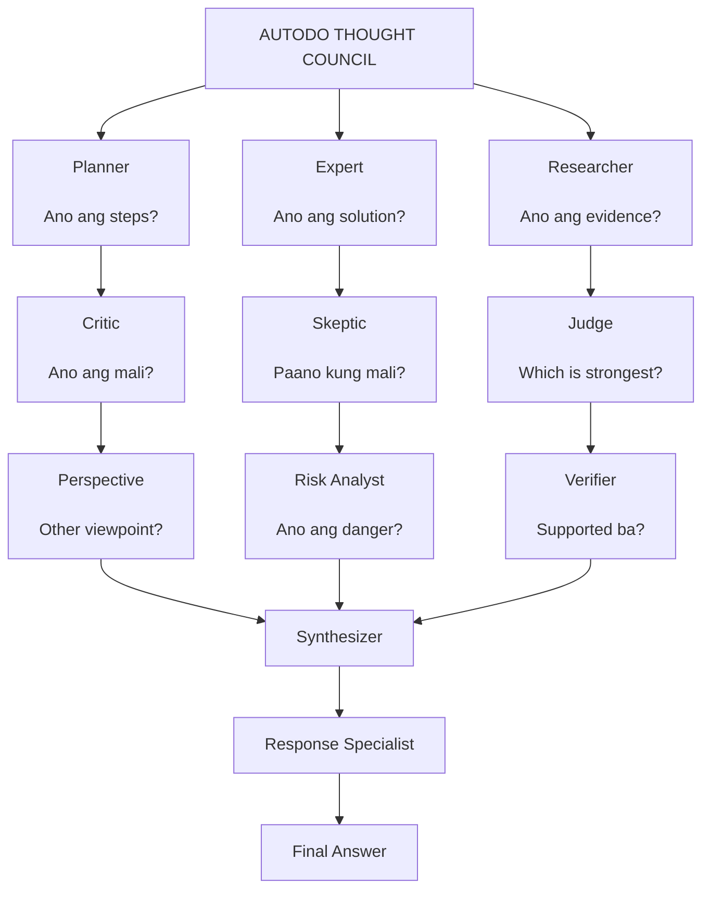

```mermaid
flowchart TD
    COUNCIL["AUTODO THOUGHT COUNCIL"]

    COUNCIL --> PLANNER["Planner<br/><br/>Ano ang steps?"]
    COUNCIL --> EXPERT["Expert<br/><br/>Ano ang solution?"]
    COUNCIL --> RESEARCHER["Researcher<br/><br/>Ano ang evidence?"]

    PLANNER --> CRITIC["Critic<br/><br/>Ano ang mali?"]
    EXPERT --> SKEPTIC["Skeptic<br/><br/>Paano kung mali?"]
    RESEARCHER --> JUDGE["Judge<br/><br/>Which is strongest?"]

    CRITIC --> PERSPECTIVE["Perspective<br/><br/>Other viewpoint?"]
    SKEPTIC --> RISK_ANALYST["Risk Analyst<br/><br/>Ano ang danger?"]
    JUDGE --> VERIFIER["Verifier<br/><br/>Supported ba?"]

    PERSPECTIVE --> SYNTHESIZER["Synthesizer"]
    RISK_ANALYST --> SYNTHESIZER
    VERIFIER --> SYNTHESIZER

    SYNTHESIZER --> RESPONSE_SPECIALIST["Response Specialist"]
    RESPONSE_SPECIALIST --> FINAL_ANSWER["Final Answer"]
```
